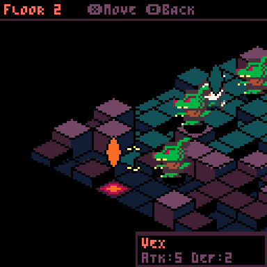
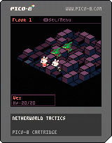

# Netherworld Tactics

A turn-based tactical RPG for PICO-8 featuring isometric graphics, strategic combat, and roguelike progression.




## Overview

Netherworld Tactics is a compact tactics game where you lead a small party through procedurally generated floors, battling enemies and pushing deeper into the netherworld. Deploy your units strategically, leverage terrain height advantages, and chain attacks with allies to defeat the zombie wolves standing in your way.

## Features

- **Isometric 3D visuals** with rotatable camera and multiple zoom levels
- **Procedurally generated maps** with varying terrain heights
- **Turn-based tactical combat** with attack chaining and height bonuses
- **Unit deployment system** via spawn gates
- **Roguelike floor progression** with scaling difficulty
- **Two playable characters** with distinct stats and roles

## Controls

| Button | Select Phase | Move Phase | Target Phase |
|--------|--------------|------------|--------------|
| ⬅️➡️⬆️⬇️ | Move cursor | Move cursor | Cycle targets |
| ❎ | Select unit / Open menu | Confirm move | Confirm attack |
| 🅾️ | Undo move | Cancel (on unit) | Back to menu |
| 🅾️ + ⬅️➡️ | Rotate camera | Rotate camera | - |
| 🅾️ + ⬆️⬇️ | Zoom in/out | Zoom in/out | - |
| 🅾️ (hold) | Show markers | Show markers | - |

## Units

### Vex
Melee warrior with high HP and balanced stats. Gets in close to deal reliable damage.
- **HP:** 20 | **ATK:** 5 | **DEF:** 2
- **Move:** 5 | **Range:** 1

### Nyx
Ranged mage with powerful attacks but fragile defenses. Strikes from a safe distance.
- **HP:** 12 | **ATK:** 8 | **DEF:** 0
- **Move:** 4 | **Range:** 2

## Gameplay

### Deployment
At the start of each floor, your units are undeployed. Move the cursor to the **Spawn Gate** and press ❎ to open the deploy menu. Select a unit to place them on the map.

### Movement & Actions
Select a deployed unit to see their movement range (blue tiles). Move to a valid tile, then choose an action:
- **Attack** - Target an enemy within range (red tiles)
- **Wait** - End the unit's turn without acting
- **Next Floor** - Available when standing on the Exit Gate after clearing enemies

### Combat System
Damage is calculated as: `ATK + chain bonus + height advantage - (DEF + height defense)`

- **Height advantage:** +2 damage per height level above target
- **Height defense:** +1 defense per height level above attacker
- **Chain attacks:** Allies within range of your target add half their ATK as bonus damage

### Action Queue
Queue up multiple attacks before executing them all at once. Use **Execute** from the menu to run all queued actions, or **End Turn** to execute and pass to the enemy phase.

### Progression
Defeat all enemies on a floor to unlock the **Exit Gate**. Move a unit onto it and select "Next Floor" to advance. Your party heals 5 HP between floors, but enemies grow stronger.

## Project Structure

```
netherworld.p8          # Main cartridge file
src/
├── main.lua            # Entry point (_init, _update, _draw)
├── scene/
│   └── game.lua        # Game state and phase management
└── sys/
    ├── actions.lua     # Player action handlers
    ├── ai.lua          # Enemy AI behavior
    ├── bindings.lua    # Input binding presets
    ├── camera.lua      # Isometric camera system
    ├── combat.lua      # Damage calculation and attacks
    ├── cursor.lua      # Cursor movement and selection
    ├── grid.lua        # Map generation and tile data
    ├── input.lua       # Input handling and state stack
    ├── menu.lua        # Menu system with tweened animations
    ├── movement.lua    # Pathfinding and range calculation
    ├── renderer.lua    # Isometric rendering and depth sorting
    ├── sprites.lua     # Sprite animation system
    ├── state.lua       # Finite state machine
    ├── tween.lua       # Tweening system for animations
    ├── ui.lua          # HUD and info panels
    ├── units.lua       # Unit management and spawning
    └── utils.lua       # Utility functions
```

## Building

The game uses PICO-8's `#include` directive to organize code across multiple files. Load `netherworld.p8` in PICO-8 to run or export the game.

## License

MIT License - Feel free to use this code as a reference for your own PICO-8 projects.
